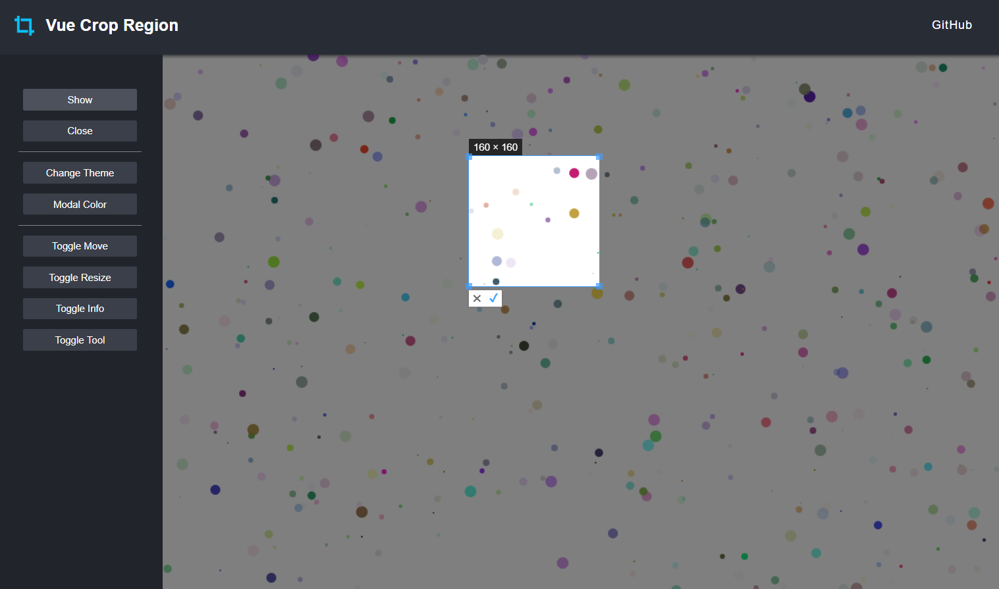

# Vue Crop Region

[vue-crop-region](https://github.com/TheoXiong/vue-crop-region) 是一个区域裁剪组件，可自由移动与缩放，实时获取所在区域的坐标信息。     
设计初衷是为了解决大量散点图无法精确点击的问题，通过区域选取批量点可进行二次处理。

## Demo
[https://theoxiong.github.io/vue-crop-region/](https://theoxiong.github.io/vue-crop-region/) 



## 安装
``` 
$   npm install vue-crop-region --save
```

## 使用

### 引入模块
```
import CropRegion from 'vue-crop-region'
```

### 注册
#### 全局注册
```
Vue.use(CropRegion)
```
#### 组件内注册
```
<script>
export default {
  components: { CropRegion }
}
</script>
```

### 基础用法

```
<template>
  <div class="base-demo" style="width:400px; height:400px; position: relative;">
    <CropRegion ref="cropper"></CropRegion>
  </div>
</template>

<script>
import CropRegion from 'vue-crop-region'

export default {
  name: 'Demo',
  mounted () {
    this.$refs.cropper.show()
  },
  components: { CropRegion }
}

</script>
```

## API

### 属性

| 属性名  | 说明   | 类型      | 可选值      | 默认值    |
| ----| --------- | ------- | ------------- | --------- |
| `borderColor`   | 边框颜色   | `string`  | - | `'#409EFF'`  |
| `pointColor`    | 点的颜色   | `string`  | - | `'#409EFF'`  |
| `confirmColor`  | 确认按钮颜色 | `string`  | - | `'#409EFF'` |
| `modalColor`    | 遮盖层颜色   | `string`  | - | `'rgba(0, 0, 0, 0.5)'` |
| `movable`   | 是否可以移动 | `boolean`  | `true/false` | `true` |
| `resizable` | 是否可以改变大小 | `boolean`  | `true/false` | `true` |
| `showInfo` | 是否显示info | `boolean`  | `true/false` | `true` |
| `showTool` | 是否显示tool | `boolean`  | `true/false` | `true` |

### 方法

| 方法名  | 说明      | 参数       | 返回       |
| ------- | -------- | ---------  | ---------- |
| `show`  | 打开     | `options: {x:number, y:number, w:number, h:number}`  指定打开的位置/大小 | 无   |
| `close` | 关闭     | -          | -           |

### 事件

| 事件名        | 说明                   | 回调参数                                                        |
| ------------- | --------------------- | -----------------------------------------------------------    |
| `confirm`     | 确认事件               | `axis: {x1:number, y1:number, x2:number, y2:number}` 坐标信息  |
| `close`       | 关闭事件               | `axis: {x1:number, y1:number, x2:number, y2:number}` 坐标信息  |


